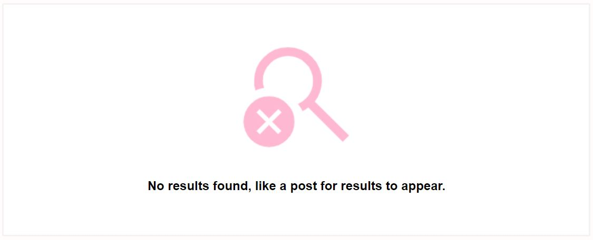

# Pinch App

## Introduction

Pinch app is the front end developed using ReactJS, is a host that allows users list items they have available for others to borrow, interested users can search for items they need to contact the owner to arrange fee, duration of rent and pick-up/drop-off. Pinch API serves as the backend for the Pinch app developed using Django Rest Framework. 

This allows users to create and view profiles and posts listings, comments, likes, have edit and delete functions to make the service possible for users.

It solves the problem of not having to purchase items that are expensive, only needed for one time use or items that even difficult to acquire or store as after use borrowers give the item back and a fraction of a fee can be charged instead of paying full price.

[Visit the deployed API here](https://pinch-api-f947cf5f7bdc.herokuapp.com/) 
[Visit the deployed website here](https://pinch-5e6e24dd12fc.herokuapp.com/)

## Site Objective
* Connect to Pinch API to make site functionality possible and hold data.
* Allow users to create profiles by registering a profile.
* Allows signed in user to post, like posts and comment on posts.
* Allows users, where appropriate, to perfom CRUD functionality.
* Provide a good UX and UI to users for the site to be easy to use.

# UX - User Experience
* Strategy Plane
* Scope Plane
* Structure Plane
* Skeleton Plane
* Surface Plane

# Strategy Plane
A plan is needed to ensure the purpose of the website meets the needs of site users, the audience, and the site owner.

## Target Audience
The target audience can be a variety of people depending on the item they need but the age ranges will be;
* 18 - 40 year olds

And sub-catergories;
* University students on limited budgets
* Homeowners to maintain their homes where one-time purchases for DIY may be a problem
* People planning events - Need extra tables, chairs, item/ clothing for weddings etc. 

## User Stories
[Link to User Stories](https://github.com/users/StringerMus/projects/7/views/1)

#### Must haves
* A user can update account details
* A user can see a list of the most popular items.
* A logged in user can create a listing to share item listing with other users.
* A user can view a navbar from every page to navigate easily between pages.
* A user can create a new account toaccess all the features for signed up users.
* A user can sign in to the app to access functionality for logged in users.

#### Should haves
* A user can search for items with keywords.
* A logged in user can add comments to an item.
* A user can keep scrolling through listings on the site, that are loaded automatically without pagination.
* A user can view other users profiles to see their item listings and their information.
* A user can click a listing to view more details of an item.
* A user can view other user's profile pictures.
* A user can view their logged in status.
* A logged in user can edit their profile to change their profile picture.
* A logged in user can like a post.

# Scope Plane
I identified 5 main pages that would be needed for the website to be able to function as required;

#### Items listings/ home page.
* This page will contain a list of items posted by users.
* Users can browse all items available.
* A search bar will be available for users to search for items based on name, catergory, location and owner.
* A section of the page will show popular items on the site, popular by likes.
* Logged in users can like posts.

#### Create a listing page
* A form for logged in users post a new item listing.
* Users can fill in information item information and upload an image.

#### Post page
* A page for each item listing for their details can be viewed.
* Logged in users can comment and like posts.
* Item owners can delete or edit post details.

#### Liked page
* Only available for logged in users.
* The page will only show items liked by an owner.

#### Profile page
* Users can view profile details.
* Amount of item listing and list of posts by profile owner.
* Profile owners can edit their user information.

#### Login/ register page
* Sign up page for new users to register
* Login page for existing users to login

# Structure Plane
For the website to be able to fulfill its goal of creating profiles, listing and viewing items, liking and commenting on posts;
* Profiles
* Posts
* Likes
* Comments

# Skeleton Plane

## Inspiration
When design is involved I always go to Pinterest for inspiration, I have looked at different layouts and colours that I could apply to this project for a coherent and positive user experience on Pinch.

### Pinterest
The two images below were a source of inspiration in terms of branding. I had imagined using pastel pink for the colour and looking through colours that would compliment pink, royal green was perfect for the mood and look for the site especially not to make the site look like it is targeting a female audience.

 

### Colour Psycpsychology
I have looked at the colour of pink and green, I found the following by Adobe

* Green -  Green color is connected to health because it represents renewal and life. It can also represent safety or permission.

* Pink - Pink is found to provide a sense of calm. That calmness brings feelings of relaxation and contentment. Pink is a soothing color, not a rousing one.

These are important this to consider for Pinch. 
 * Trust - This will be an important aspect to the site. Lenders would have to trust lendees with their item and pay as promised. Lendees will need to trust lenders items are what they promise.
 * Renewal - This service is eco-friendly as existing items are being re-used.

### Airbnb
I have looked at [Airbnb](https://www.airbnb.co.uk/) because I realise the service is similar to Pinch, airbnb are very well established and have done well to provide good user experience to their renters and rentees.

### Fat Llama
I have also found an existing site called [Fat Llama](https://fatllama.com/uk) to see what a potential competitor does and what they do well to take inspiration from and what can be improved.

### Font
Couple of fonts have been looked at but these two were chosen;

Title and logo - 'Tilt Warp'
This font thick and has curves that look soft and playful so the brand does not look to serious.

Typecase - 'Poppins'
Looks very much like other san-serif fonts but it has a slight difference to differentiate Pinch to other brands as fonts such as 'Roboto' and 'Futura' are very popular amongst other brands.

### Favicon

I have chosen this icon as the favicon for the site inspired by the pinch image on pinterest. It a finger tapping on a screen which would represent the use of the site, everything is a finger tap away from getting what the user needs.

## Wireframes

* [Home/ Post listings](media/wireframe/home.JPG)
* [Post page](media/wireframe/post.JPG)
* [Listing create/ edit form](media/wireframe/list_create_edit.JPG)
* [Liked](media/wireframe/liked.JPG)
* [Profile page](media/wireframe/profile_page.JPG)
* [Edit profile](media/wireframe/edit_profile.JPG)
* [Change username](media/wireframe/change_username.JPG)
* [Update password](media/wireframe/password.JPG)
* [Sign up](media/wireframe/sign-up.JPG)
* [Sign in](media/wireframe/sign-in.JPG)

# Features
## Navbar
The navbar appears on all pages at all times. Its the tool for user to navigate through the site. The logo is also a link, when clicked it will take the user back to the homepage.

### Logged out
The navbar links change depending on a users login status. If a user is not logged in they will only see;
- Home
- Sign in
- Sign up

### Logged in
But if they are Logged in, they will see;
- Home
- List item
- Liked
- Profile page
- Sign out

### Responsive
The nav condenses into a burger menu when the screen width shrinks less than 768px. When a user clicks the burger it opens up a dropdown of the links.

## Sign-up/ sign-in

### Sign-up
The sign-up contains the sign up form and a picture advertising the site showing what could be available.
The form is simple, a user just needs to create a unique username, a password not too simple and confirm the password to sign up. 
If the form does not meet the username or password criteria, this will be fed back to the user.

There is a prompt and a link for existing users to go to the sign in page if they visit the sign-up page to login. 

### Sign-in
The sign-in page contains the sign in form and a different picture of a person using a tool which could also be available on the site.
The sign in form asks users for the username and password to login. If the fields do not match an existing users details, the user will be unable to login.

There also a prompt and a link for non-existing users to go to the sign up page if they visit the sign-in page.

### Notification
A notification pops up at the bottom of the screen to notify users when they have logged in and signed up successfully.

### Responsive
When the screen width is reduced less than 768px, the picture reduces and only form and sign in page link is visible.

## Home/ Post listings
The home page lists all items posted by users in order of recent created date. Users can start scrolling down through the list of posts and view their details.

Before the item listings, there are introductory messages to explain to new users what the website is about and also provides a step by step of how to utlise the site.

There is a search bar also available if the user already knows what they are looking to perform a quick search instead of scrolling the site. Users are able to search for items via the owner, item name, category and location. It has only been limited to these fields as these are more finer search fields - price and description might not come refine the search enough, especially description as same words can be applied to multiple items.

### Listings
The listings on the home page lists all items as cards that contains items details for user to view, item owner, like and comment icons and counters.
* The owner profile and name are linked to the owners profile page.
* Logged in users can like posts on the listings and item owners cannot like their own item.
* Clicking the item image and comments icon will take the user to items detail page.

### Popular posts
This feature appears on the right hand side of the page and it is lists 5 of the most popular items by the number of likes. This wil automatically update depending on the like counters on posts.

### Infinite scroll
The home page does not paginate, the page will continue loading posts and until the end of the listings is reached.

### Responsive
If the width of the screen is less than 768px, this change the layout of the page. The page turns into a single column - The posts details moves underneath the image and the popular items section will move under the search bar and it will change to a list of three.

## Posts

### Post detail
Each item listing have their own detail view for users to have a closer look and also view the comments.
* Owners of posts will be able to edit or delete their own posts by clicking the three dots underneath the item image to open a sub menu.
* The edit button will take the owner to the edit listing page.
* Logged in user will be able to post a comment and also like the posts.
* The owner profile and name are linked to the owners profile page.
* The Popular Items column also appears next to the post details.

### Like
Only logged in users can like posts but owners of posts will be unable to like their own listings and a overlay message will come up for these users to notify them.
 - The like counters will go up when liked and down if unliked.
 - The heart icon will also change colours to notify users if they have a liked a listing.

### Comment
The comment form appears underneath post details, only logged in users can post comments on item listings. When comments are posted, it shows the commentors name and profile image, the comment and how long ago the comment was posted.
- Comment owners can edit or delete their own comments, theres a three dot drop-down that opens up a sub menu.
- A notification pops up at the bottom of the screen to notify users when they have posted, edited or deleted a comment.
- The comment counter will go up or down depending on the number of comment the item listing has.
- The comment section also has the infinite scroll feature.

### Responsive
When the screen width becomes less than 768px, the page becomes a single column and like other pages - The post detail moves under the image and the Popular Items moves to the top of the page as a list of 3.

## List item
This is the page where user can list an item on Pinch by filling out Create listing form.

* An image will need to be uploaded, informing users the max file size is 2mb and max height and width is 4096px - the form will not submit and notify if these conditions are not met.

### Form
There are fields the form requires for a user to be able to successfully list an item
- item name
- image
- email address
- location
If these are not filled correctly, notifications come underneath the form and image box for the image error.
- The price field requires a figure equal to zero or above and no more than 3 decimal places.

The price and category fields do not particularly require to be filled in
- Price - As lending requests are handled by email between an owner and requestor, price can be negotiated with owner and default value will be 0 if not filled in.
- Catergory - This field is more for filtering purposes, the default value will be 'other'.

A notification will pop up at the bottom of the screen when a user successfully lists an item.

### Reponsiveness
When the screen width becomes less than 768px, page turn into a single column with the image upload section at the top and the form underneath.

## Edit listing form
When an owner clicks the edit icon on the post details, they are taken to the Edit listing page for that post. The image and form fields will be already filled in with the posts existing details.

The functionality and form requirements of the Edit listing page and form is the same as the Post listing. When the form is submitted, the item listings details are updated and a notification appears to confirm successful action.

## Liked
This page is only available for logged in users, the page filters all listing to the posts liked by the user and if there are no liked items, the page will notify the user no results were found and to like a post.

## Reponsiveness
Just like all other pages with posts when the screen width becomes less than 768px, the post detail moves under the image.

## Profile page
The page contains all information on the profile owner in terms of username, profile image, number of listings posted by the user and the list if these items. The page also has the infinite scroll feature, the page will continue loading posts until the last post is reached.

### Edit
This will only be available to the profile. If the three dots are clicked, a dropdown of sub menu appears listing edit profile, change username and change password.
Popular items appear on the side of the page also.

Edit profile - Takes the user to a page where users can change their profile image.

Change username - A page where a user can fill a form to change their username - the username has to be unique. 

Change password - A page is loaded for the user to fill a form to update their password and confirm. The password field follows the same requirements as the sign up form.

### Reponsiveness
When the screen becomes less than 768px, the page turn into a single column with the popular posts moving to the top as a list of 3. The profile image moves to the top of the profile name and number of listings. Just like the other pages, the post details move under the posts images.

## Defensive Design

### Redirection
The useRedirect hook is in place so user's can't access pages where they have not been appropeiately authenticated to prevent unauthorised access.

### 404 page
If an invalid url is input, a custom 404 page will appear for the user encouraging the user to go back or vist an existing page.

# Testing

## Not logged in

### Navbar

### Home
Search bar
 - no results, only itemname, category, username, location
Item listing
Infinite scroll
Like
Comment
popular items
Profile

### Post details
View post details
Unable to like
Popular items
Profiles

### Profiles
view profile details and item listings
click item lisitngs
click popular items

### Sign-in
Sign up form and image
No blank form
invalid data
link to sign up page
refreshtoken
Sign in with credentials

## Sign-up 
Sign in form and image
No blank form
invalid data - password/ unique name
link to sign in page
double sumbit

## Navbar
Nav links change
- list item, liked, sign out, profile page
signout to logout

## Home
post page to behave as logged out
like items
unable to like own items

## List item
Image field
Required
- item name, location, contact email and image
Item name: Ensure this field has no more than 255 characters.
price
- No values less than 0 or more than 2 decimals
- default value is 0 if empty
Default category other if not selected
Test all categories
invalid messages
double click post
cancel
post

## Post detail
post detail same as logged out user
like
comment
- post and edit, infinite scroll
post owner edit or delete

## Post edit
auto populate fields, behaviour same as post create form
updates lisitng details

## Liked Page
Only filters posts like by the user
0 liked message

## Profile page
Profile image name and name, number of listings
lists posts created by user.
Edit
- Edit profile
    - change profile image and update
- Edit username
    - Unique username and update
- Change password
    - password requirements
    - update

## responsiveness
- Layout on all screens
- list screen sizes

## Toasts
- notification when 
    - logged in, log out, sign up, 
    - post create, post edit, post delete, 
    - comment edit, comment delete.
    - Profile image, username, password

## Redirect
- cannot access unauthorised pages/ links
- redirect to home page

## 404page
- invalid urls

## Components
Asset
Avatar
MoreDropdown
Navbar
NotFound

# Future Enhancements
* Saved items - Give users the ability save items they are interested in so it can recorded as a list to refer back when needed, at the moment users can use the liked page to be able to access items they are interested in to refer back to.

* Email request - Allow users to put in a request to borrow via a button on a post. This will prompt a form for requestees to fill out important information like date of pickup, number of days and contact email.

* A calendar - This can show interested users the days the item is available to rent to ensure items aren't being requested whilst they are unavailable.

# Technologies

## List of front-end libraries
React Router:
React Bootstrap: 