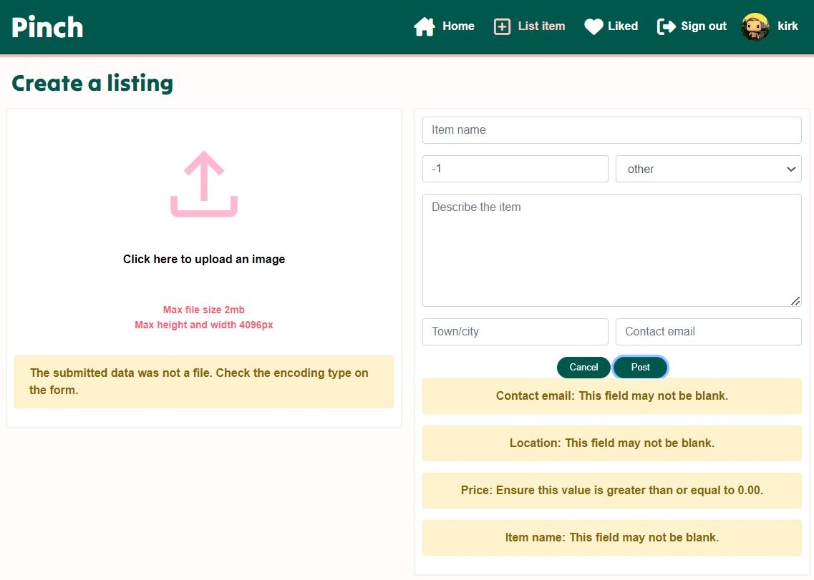
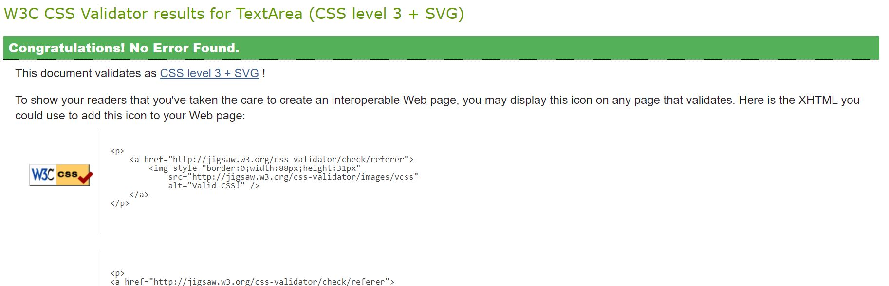

# Pinch App

## Introduction

Pinch app is the front end developed using ReactJS, is a host that allows users list items they have available for others to borrow, interested users can search for items they need to contact the owner to arrange fee, duration of rent and pick-up/drop-off. Pinch API serves as the backend for the Pinch app developed using Django Rest Framework. 

This allows users to create and view profiles and posts listings, comments, likes, have edit and delete functions to make the service possible for users.

It solves the problem of not having to purchase items that are expensive, only needed for one time use or items that even difficult to acquire or store as after use borrowers give the item back and a fraction of a fee can be charged instead of paying full price.

[Visit the deployed API here](https://pinch-api-f947cf5f7bdc.herokuapp.com/) 
[Visit the deployed website here](https://pinch-5e6e24dd12fc.herokuapp.com/)

## Site Objective
* Connect to Pinch API to make site functionality possible and hold data.
* Allow users to create profiles by registering a profile.
* Allows signed in user to post, like posts and comment on posts.
* Allows users, where appropriate, to perfom CRUD functionality.
* Provide a good UX and UI to users for the site to be easy to use.

# UX - User Experience
* Strategy Plane
* Scope Plane
* Structure Plane
* Skeleton Plane
* Surface Plane

# Strategy Plane
A plan is needed to ensure the purpose of the website meets the needs of site users, the audience, and the site owner.

## Target Audience
The target audience can be a variety of people depending on the item they need but the age ranges will be;
* 18 - 40 year olds

And sub-catergories;
* University students on limited budgets
* Homeowners to maintain their homes where one-time purchases for DIY may be a problem
* People planning events - Need extra tables, chairs, item/ clothing for weddings etc. 

## User Stories
[Link to User Stories](https://github.com/users/StringerMus/projects/7/views/1)

#### Must haves
* A user can update account details
* A user can see a list of the most popular items.
* A logged in user can create a listing to share item listing with other users.
* A user can view a navbar from every page to navigate easily between pages.
* A user can create a new account toaccess all the features for signed up users.
* A user can sign in to the app to access functionality for logged in users.

#### Should haves
* A user can search for items with keywords.
* A logged in user can add comments to an item.
* A user can keep scrolling through listings on the site, that are loaded automatically without pagination.
* A user can view other users profiles to see their item listings and their information.
* A user can click a listing to view more details of an item.
* A user can view other user's profile pictures.
* A user can view their logged in status.
* A logged in user can edit their profile to change their profile picture.
* A logged in user can like a post.

# Scope Plane
I identified 5 main pages that would be needed for the website to be able to function as required;

#### Items listings/ home page.
* This page will contain a list of items posted by users.
* Users can browse all items available.
* A search bar will be available for users to search for items based on name, catergory, location and owner.
* A section of the page will show popular items on the site, popular by likes.
* Logged in users can like posts.

#### Create a listing page
* A form for logged in users post a new item listing.
* Users can fill in information item information and upload an image.

#### Post page
* A page for each item listing for their details can be viewed.
* Logged in users can comment and like posts.
* Item owners can delete or edit post details.

#### Liked page
* Only available for logged in users.
* The page will only show items liked by an owner.

#### Profile page
* Users can view profile details.
* Amount of item listing and list of posts by profile owner.
* Profile owners can edit their user information.

#### Login/ register page
* Sign up page for new users to register
* Login page for existing users to login

# Structure Plane
For the website to be able to fulfill its goal of creating profiles, listing and viewing items, liking and commenting on posts;
* Profiles
* Posts
* Likes
* Comments

# Skeleton Plane

## Inspiration
When design is involved I always go to Pinterest for inspiration, I have looked at different layouts and colours that I could apply to this project for a coherent and positive user experience on Pinch.

### Pinterest
The two images below were a source of inspiration in terms of branding. I had imagined using pastel pink for the colour and looking through colours that would compliment pink, royal green was perfect for the mood and look for the site especially not to make the site look like it is targeting a female audience.

 

### Colour Psycpsychology
I have looked at the colour of pink and green, I found the following by Adobe

* Green -  Green color is connected to health because it represents renewal and life. It can also represent safety or permission.

* Pink - Pink is found to provide a sense of calm. That calmness brings feelings of relaxation and contentment. Pink is a soothing color, not a rousing one.

These are important this to consider for Pinch. 
 * Trust - This will be an important aspect to the site. Lenders would have to trust lendees with their item and pay as promised. Lendees will need to trust lenders items are what they promise.
 * Renewal - This service is eco-friendly as existing items are being re-used.

### Airbnb
I have looked at [Airbnb](https://www.airbnb.co.uk/) because I realise the service is similar to Pinch, airbnb are very well established and have done well to provide good user experience to their renters and rentees.

### Fat Llama
I have also found an existing site called [Fat Llama](https://fatllama.com/uk) to see what a potential competitor does and what they do well to take inspiration from and what can be improved.

### Font
Couple of fonts have been looked at but these two were chosen;

Title and logo - 'Tilt Warp'
This font thick and has curves that look soft and playful so the brand does not look to serious.

Typecase - 'Poppins'
Looks very much like other san-serif fonts but it has a slight difference to differentiate Pinch to other brands as fonts such as 'Roboto' and 'Futura' are very popular amongst other brands.

### Favicon

I have chosen this icon as the favicon for the site inspired by the pinch image on pinterest. It a finger tapping on a screen which would represent the use of the site, everything is a finger tap away from getting what the user needs.

## Wireframes

* [Home/ Post listings](media/wireframe/home.JPG)
* [Post page](media/wireframe/post.JPG)
* [Listing create/ edit form](media/wireframe/list_create_edit.JPG)
* [Liked](media/wireframe/liked.JPG)
* [Profile page](media/wireframe/profile_page.JPG)
* [Edit profile](media/wireframe/edit_profile.JPG)
* [Change username](media/wireframe/change_username.JPG)
* [Update password](media/wireframe/password.JPG)
* [Sign up](media/wireframe/sign-up.JPG)
* [Sign in](media/wireframe/sign-in.JPG)

# Features
## Navbar
The navbar appears on all pages at all times. Its the tool for user to navigate through the site. The logo is also a link, when clicked it will take the user back to the homepage.

### Logged out
The navbar links change depending on a users login status. If a user is not logged in they will only see;
- Home
- Sign in
- Sign up

### Logged in
But if they are Logged in, they will see;
- Home
- List item
- Liked
- Profile page
- Sign out

### Responsive
The nav condenses into a burger menu when the screen width shrinks less than 768px. When a user clicks the burger it opens up a dropdown of the links.

## Sign-up/ sign-in

### Sign-up
The sign-up contains the sign up form and a picture advertising the site showing what could be available.
The form is simple, a user just needs to create a unique username, a password not too simple and confirm the password to sign up. 
If the form does not meet the username or password criteria, this will be fed back to the user.

There is a prompt and a link for existing users to go to the sign in page if they visit the sign-up page to login. 

### Sign-in
The sign-in page contains the sign in form and a different picture of a person using a tool which could also be available on the site.
The sign in form asks users for the username and password to login. If the fields do not match an existing users details, the user will be unable to login.

There also a prompt and a link for non-existing users to go to the sign up page if they visit the sign-in page.

### Notification
A notification pops up at the bottom of the screen to notify users when they have logged in and signed up successfully.

### Responsive
When the screen width is reduced less than 768px, the picture reduces and only form and sign in page link is visible.

## Home/ Post listings
The home page lists all items posted by users in order of recent created date. Users can start scrolling down through the list of posts and view their details.

Before the item listings, there are introductory messages to explain to new users what the website is about and also provides a step by step of how to utlise the site.

There is a search bar also available if the user already knows what they are looking to perform a quick search instead of scrolling the site. Users are able to search for items via the owner, item name, category and location. It has only been limited to these fields as these are more finer search fields - price and description might not come refine the search enough, especially description as same words can be applied to multiple items.

### Listings
The listings on the home page lists all items as cards that contains items details for user to view, item owner, like and comment icons and counters.
* The owner profile and name are linked to the owners profile page.
* Logged in users can like posts on the listings and item owners cannot like their own item.
* Clicking the item image and comments icon will take the user to items detail page.

### Popular posts
This feature appears on the right hand side of the page and it is lists 5 of the most popular items by the number of likes. This wil automatically update depending on the like counters on posts.

### Infinite scroll
The home page does not paginate, the page will continue loading posts and until the end of the listings is reached.

### Responsive
If the width of the screen is less than 768px, this change the layout of the page. The page turns into a single column - The posts details moves underneath the image. After the width reduces less than 992px, the popular items section will move under the search bar and it will change to a list of three.

## Posts

### Post detail
Each item listing have their own detail view for users to have a closer look and also view the comments.
* Owners of posts will be able to edit or delete their own posts by clicking the three dots underneath the item image to open a sub menu.
* The edit button will take the owner to the edit listing page.
* Logged in user will be able to post a comment and also like the posts.
* The owner profile and name are linked to the owners profile page.
* The Popular Items column also appears next to the post details.

### Like
Only logged in users can like posts but owners of posts will be unable to like their own listings and a overlay message will come up for these users to notify them.
 - The like counters will go up when liked and down if unliked.
 - The heart icon will also change colours to notify users if they have a liked a listing.

### Comment
The comment form appears underneath post details, only logged in users can post comments on item listings. When comments are posted, it shows the commentors name and profile image, the comment and how long ago the comment was posted.
- Comment owners can edit or delete their own comments, theres a three dot drop-down that opens up a sub menu.
- A notification pops up at the bottom of the screen to notify users when they have posted, edited or deleted a comment.
- The comment counter will go up or down depending on the number of comment the item listing has.
- The comment section also has the infinite scroll feature.

### Responsive
If the width of the screen is less than 768px, this change the layout of the page. The page turns into a single column - The posts details moves underneath the image. After the width reduces less than 992px, the popular items section will move under the search bar and it will change to a list of three.

## List item
This is the page where user can list an item on Pinch by filling out Create listing form.

* An image will need to be uploaded, informing users the max file size is 2mb and max height and width is 4096px - the form will not submit and notify if these conditions are not met.

### Form
There are fields the form requires for a user to be able to successfully list an item
- item name
- image
- email address
- location
If these are not filled correctly, notifications come underneath the form and image box for the image error.
- The price field requires a figure equal to zero or above and no more than 3 decimal places.

The price and category fields do not particularly require to be filled in
- Price - As lending requests are handled by email between an owner and requestor, price can be negotiated with owner and default value will be 0 if not filled in.
- Catergory - This field is more for filtering purposes, the default value will be 'other'.

A notification will pop up at the bottom of the screen when a user successfully lists an item.

### Reponsiveness
When the screen width becomes less than 768px, page turn into a single column with the image upload section at the top and the form underneath.

## Edit listing form
When an owner clicks the edit icon on the post details, they are taken to the Edit listing page for that post. The image and form fields will be already filled in with the posts existing details.

The functionality and form requirements of the Edit listing page and form is the same as the Post listing. When the form is submitted, the item listings details are updated and a notification appears to confirm successful action.

## Liked
This page is only available for logged in users, the page filters all listing to the posts liked by the user and if there are no liked items, the page will notify the user no results were found and to like a post.

## Reponsiveness
Just like all other pages with posts when the screen width becomes less than 768px, the post detail moves under the image.

## Profile page
The page contains all information on the profile owner in terms of username, profile image, number of listings posted by the user and the list if these items. The page also has the infinite scroll feature, the page will continue loading posts until the last post is reached.

### Edit
This will only be available to the profile. If the three dots are clicked, a dropdown of sub menu appears listing edit profile, change username and change password.
Popular items appear on the side of the page also.

Edit profile - Takes the user to a page where users can change their profile image.

Change username - A page where a user can fill a form to change their username - the username has to be unique. 

Change password - A page is loaded for the user to fill a form to update their password and confirm. The password field follows the same requirements as the sign up form.

### Reponsiveness
When the screen width becomes less than 992px, the page turn into a single column with the popular posts moving to the top as a list of 3. The profile image moves to the top of the profile name and number of listings. Just like the other pages, the post details move under the posts images.

## Defensive Design

### Redirection
The useRedirect hook is in place so user's can't access pages where they have not been appropeiately authenticated to prevent unauthorised access.

### 404 page
If an invalid url is input, a custom 404 page will appear for the user encouraging the user to go back or vist an existing page.

# Testing

## Not logged in
The features below were tested as a logged out user.

### Navbar
* Expected – The navbar to contain the logo on the left side and on the right side ‘home’, ‘sign-in’ and ‘sign-up’ icons. When hovered over the icons, they change color and the links change colour depending on the page users are visiting.
* Testing – Visit the site as a logged-out user and click the links to ensure they are working as intended.
* Result – Links work as expected. The logo, ‘home’, ‘sign-in’ and ‘sign-up’ icon links appear and take the user to the correct pages as expected. The icons change colour when hovered over and depending on the page a user is visiting.

### Home

#### Homepage
* Expected – The homepage contains the intro and step-by-step instructions, with the search bar underneath and listing all posts ordered by most recent posts. The home page also includes a list of 5 popular items on the right side of the page.
* Testing – Visit the homepage and view what the page renders.
* Result – The page is loading as expected, with all the elements loaded and can scroll through a list of all items viewing the item image and details.

#### Search bar
* Expected – The search bar is present and is able to filter listed items that contain the value of their search in their name, category, username and location. If no items are found, this is notified to the user.
* Testing – Use the search bar to search for items, view what no-matched results look like, create posts that have the same names as existing posts and place them in different fields to see the outcome.
* Result – The search bar is working as expected. Posts are being filtered that match the searched word if it is contained when with the item, category, owner name and location. No matched results tells users no results were found and to try a different search.

#### Like
* Expected – A non-registered user should not be able to like items and a overlay message should appear advising users to login to like a listing.
* Testing – Click the heart icon as a logged-out user to attempt to like items.
* Result – Like function working as expected, unable to like posts and overlay message appearing advising to log in.

#### Comment
* Expected – The comment icon changes colour when hovered over and when clicked, it will take the user the posts details page.
* Testing – Hover over comment icon on and posts and click the icon.
* Result – When hovered over the icon changes colour and when clicked, the user is directed to the posts details page.

#### Popular Items
* Expected – The popular items list appears next to all post listing of the top 5 most liked items and when clicked, the user is directed to the posts detail page.
* Testing – Review like counts on posts to view if items are ordered by the number of likes and click on items. 
* Result – Popular items are working as expected, the posts are listed by the number of likes – if posts have the same number of likes these are ordered by the most recent post. Click on the items takes users to their post detail pages.

### Profile
* Expected – The name and avatars of owners of posts appears on the posts and when clicked, users are taken to their profile pages.
* Testing – Click on the icons and avatar of post owners.
* Result – The profile image and avatars are working as expected, post owners are visible on each post and click on their name or avatar take users to their profile page.

#### Infinite Scroll
* Expected – When the list of posts exceeds 10, the page does not paginate but the list continues as additional posts are rendered until the end of the list is reached.
* Testing – Scroll past 10 posts and view if additional posts are rendered or if the page paginates.
* Result – The feature is working as expected, the continues to render and is not paginated until the first item listing post has been reached.

### Post details

#### Post
* Expected – After clicking on a post from the homepage, the user should be taken to the post’s detail page containing the same details, number of likes and comments, if there are comments users can view them below the item’s details. Also view the popular items list on the right side.
* Testing – Click on posts on the homepage and review the details populated on the posts detail page.
* Result – The feature is working as expected. The page renders correctly with the post’s details, number of likes, number of comments render if there are any and if there aren’t any comments it prompts a signed-out user to sign up to leave a comment. The popular items list also renders correctly.

#### Unable to like
* Expected – Just like on the home page, a non-registered user should not be able to like items and a overlay message should appear advising users to login to like a listing.
* Testing – Click the heart icon as a logged-out user to attempt to like items.
* Result – Like function working as expected, unable to like posts and overlay message appearing advising to log in.

#### Popular Items
* Expected – List should match the home page and when clicked on an item, the user is directed to the posts detail page.
* Testing – Match the Popular items list to the homepage and click on items. 
* Result – Popular items are working as expected, the list is the same as homepage. Click on the items takes users to their post detail pages.

#### Profile
* Expected – Same the homepage, the item owners name and avatar should appear on the posts and when clicked, users are taken to their profile pages.
* Testing – Click on the icons and avatar of post owners.
* Result – The profile image and avatars are working as expected, post owners are visible on each post and click on their name or avatar take users to their profile page.

### Profiles

#### View profile details and listings
* Expected – Logged-out users can view profiles of item owners to view profile details and item listings by the owners.
* Testing – Click on the profiles of item owners and view the page.
* Result – Working as expected, when an item owner's profile is clicked the user can view the item owner’s name, profile image and number of listings. Below the profile details, the list of items listed by the profile owner appears. Also the infinite scroll feature is working, if there are more than posts, the page does not paginate but loads more posts.

#### Item lisitng
* Expected – The items listings should all belong to the profile owner. After clicking on a post from the homepage, the user should be taken to the post’s detail page
* Testing – Review the owner of item listings on profile pages. Click on item listings.
* Result – Functioning as expected, all items below to the profile owner. When clicked the post detail page renders correctly.

#### Popular Items
* Expected – Like post details, the list should match the home page and when clicked on an item, the user is directed to the posts detail page.
* Testing – Match the Popular items list to the homepage and click on items. 
* Result – Popular items are working as expected, the list is the same as homepage. Click on the items takes users to their post detail pages.

## Sign-up 

### Sign up
* Expected – The sign-up page renders with the signup form and image. The form cannot have a blank field submitted, password criteria need to be met and username has to be unique for successful submission. Successful sign-up should create a new user and sign the user in automatically. Spamming the submit button after submitting the 1st time should not work.
* Testing – Will attempt to sign up with invalid details, submit a blank form, submit with invalid username and password requirements and submit the form with valid details and spam submit.
* Result – Working as expected, invalid details are not accepted and error feedback is given. Spamming submit does not do anything, a new account is created, the new user is signed in automatically and a refresh token is created.

### Sign in link
* Expected – The link to the signin page will take the user to the sign in page.
* Testing – Click the sign in page link
* Result – Link is working, user is taken to the sign in page.

### Sign-in
* Expected – The sign-in page renders with the signin form and image. The form cannot have a blank fields submitted, the username and password need to match an exister user credential. Successful sign-in logs the user in as the correct user and a refersh token is created.
* Testing – Will attempt to sign in with invalid details, submit a blank form and then submit the form with valid details.
* Result – Working as expected, invalid details are not accepted and error feedback is given. The user is signed in and a refresh token is created.

### Sign up link
* Expected – The link to the signup page will take the user to the sign in page.
* Testing – Click the sign up page link
* Result – Link is working, user is taken to the sign up page.

## The following tests have been completed as a logged in user

## Navbar
* Expected – After signing in, the navbar links change for logged-in users. The navbar to change to Home, List Item, Liked, Sign out and Profile with image and profile name.
* Testing – Sign in and view the nav bar.
* Result – The navbar changes as expected.

### Sign out
* Expected – If the sign out link is clicked, the user is signed out.
* Testing – Click sign out as a logged in user.
* Result – The user successfully signs out.

## Home
* Expected – The homepage renders the same as a logged out user, the search and popular items functions work the same. The logged in user can like items on the listings. When posts are liked the heart icon changes colour and counter changes. A logged in user is unable to like their own posts
* Testing – View homepage and like posts.
* Result – Working as expected, the homepage renders the same and the search and popular items functions work the same. The icon changes colour and counter changes when a user likes and un-likes a post and a logged in user is unable to like their own posts.

## List item
* Expected – The list item link takes users to the Create a listing page which has an Image field and create listing form. The form does not submit if the field requirements are not met. Spamming post will not create duplicate posts.
* Testing – Visit the Create a Listing form and attempt to submit the form with invalid information in the fields. Submit a form to view a successful submission.
* Result – Form working as expected. The form does not submit with invalid data, the item name, location, contact email and image field is required. Contact email has to be an email, price field cannot be a figure less than 0 and more than 2 decimal places. The image cannot be more 2mb and more than 4096px in width and height - users will be notified of errors.
If the price field is blank the default value is 0.00, the default value for category will be other and the description will be blank if not filled.
 Hitting cancel will take the user back to the previous page they were on. Spamming post will not create duplicate posts and after submission, the item listing is created successfully. The user is directed to the post details page and the item also appears on the home page.

## Post detail
* Expected – The post detail page renders the same as a logged-out user. Logged-in users can leave comments and like posts. Owners of the post cannot like the post and will have a drop-down available for edit and delete functions.
* Testing – Visit a post and owned by a user and a post not owned by a user. Click on the drop-down on a user-owned post.
* Result – Post detail for a logged-in user working as expected. Page renders the same as a logged-out user but can like a post and a comment for is available. If a post is liked or un-liked, the like counter changes. Post owners have a drop-down available to either edit or delete a post.

### Delete post
* Expected – Users can only delete their own posts.
* Testing – Click the delete icon on the post drop on a post owned by the user to delete post. Visit a post owned by a another user to view dropdown.
* Result – Delete is working as expected, user can only delete their post and cannot delete a post owned by another user.

## Comments
* Expected – Logged in users can fill out the comment form and post a comment. Spamming post will not create a duplicate post. There is a dropdown available for comments owned by a user, they can be edited and deleted by a user.
* Testing – Comment on a post, edit and delete the comment.
* Result – Featured worked as expected. Comment created under a post, comment counters change depending on the number of comments. Users can only edit and they own comments, user owned comments can be edited and updated, there is a cancel button for users to cancel an edit. User can also delete their comments.

### Infinite scroll
* Expected – If the number of comments exceeds 10, the comments dont paginated by render the remaning comments until the end is reached.
* Testing – Create more than 10 comments underneath a post.
* Result – Comments continue to load and render after a list of 10.

## Post edit
* Expected – A user can edit their own listing item by click the edit on post detail. The use gets directed to the edit listing page with the form filled in with existing details. The form has the same requirements as the post create form and on submission updates the post.
* Testing – Attempt to update a post created by logged in user. Attempt invalid details, successfully post a valid form and and view updated post.
* Result – The edit feature works as expected. The form fields are pre-populated with current listing information, the fields have the same requirements and error messages as Create a Listing form and the post updates with new details.

## Liked Page
* Expected – The page populates with posts liked by the user. If there are 0 liked posts, there is a message advising the user to like posts.
* Testing – Like posts and visit the Liked page. View Liked page with 0 like page.
* Result – Liked page functioning as expected, page filters only on posts liked by the user. If there are not liked posts, user is advised no results were found and to like posts for results to appear. When posts are unliked on the Liked page, after refresh the page will update correctly.

## Profile page
* Expected – Profile pages render the same as a logged out user for all profiles. User owned profiles have a dropdown to allow users to edit their profile picture, username and password.
* Testing – Visit other users profiles and the user owned profile page. 
* Result – Feature is working as expected. Profile pages render correct, users can edit their profiles as their is drop down with options edit profile, username and password.

### Edit profile
* Expected – When edit profile is clicked, the user is taken to the edit profile page. Users can change their profile picture, if saved the profile picture updates and if canceled, the user is taken back to the previous page.
* Testing – Visit the edit profile page by clicking the edit profile option on the dropdown. Choose a new profile image and update.
* Result – Test passed as expected.

### Edit username
* Expected – When change username is clicked from the profile dropdown, the user is taken to the Change username page. Users can change their username, the requirement is it has to be unique. If saved, the username is updated and if canceled, the user is taken back to the previous page.
* Testing – Visit the Change username page from the user owned profile by clicking the change username option on the dropdown. Try submitting an existing username and try a valid username. Attempt login with new username.
* Result – Test passed as expected, login with new username was successful.

### Change password
* Expected – When change password is clicked from the profile dropdown, the user is taken to the Change password page. Users can change their password, the password requirement is the same as the sign up. If saved, the password is updated and if canceled, the user is taken back to the previous page.
* Testing – Visit the Change password page from the user owned profile by clicking the change password option on the dropdown. Try submitting invalid passwords and try a password. Attempt login with new password.
* Result – Test passed as expected, login with new password was successful.

## Responsiveness
- Layout on all screens
- list screen sizes

* Expected – The site has been tested on different screen sizes - 1440px, 1024px, 768px, 425px, 320px. The screen layout changes into single column after 768px, stacking forms and post details underneath post image in home and profile page information as shown in features. The popular items section condenses to a list of 3 at the top when width is less than 992px and Navbar condenses to a burger menu if width is less that 768px.
* Testing – Test pages on the different screen sizes
* Result – Navbar does not looked good after screensizes less 992px if the username is long.
* Fix - Turn the Navbar into a burger menu if screensize less than 992px.

## Toasts
* Expected – Users receive notifications to confirm successful action at the bottom of the page when they complete the following actions;
    - logged in, log out, sign up, 
    - post create, post edit, post delete, 
    - comment edit, comment delete.
    - Profile image, username, password
* Testing – Trigger notification by completing the actions.
* Result – Notifications appear as expected.

## Redirect
* Expected – A user is unable to gain access to pages they do not have authorisation for, users are redirected to the homepage.
* Testing – Attempt to acces pages user do not have access to but typing urls to gain access non logged in users 
* Result – Feature is working as expected. If a logged out uses '/liked' in the url they are able to access the page but this only provides the user with a list of all item listings where they are still unable to make any changes.

## 404page
* Expected – If a user types in an invalid url, they are shown a custom 404 page.
* Testing – Type an invalid url for the website.
* Result – 404 page comes up as expected.

## Bugs and fixes
* Bug - Tokens not registering in browser causing the page to go blank after signin
* Fix - Amend token code in utils.js. New version of dj_rest_auth was being used, naming convention was slightly different - this has been corrected.

* Bug - If Profile page is refreshed, another users details profile name and image is shown. 
* Fix - Unused code for a Following feature in ProfileDataContext was causing this - removed unused code. 

* Bug - Avatar icon not appearing on navbar.
* Fix - New version of dj_rest_auth was being used, needed to put USER_DETAILS_SERIALIZER under REST_AUTH.

* Bug - If the items on the API gets pushed to the second page, the Popular Items function will not pick up the item details and list would not be correct.
* Fix - Added logic to loop through all pages of posts in API to collect all data from posts.

* Bug - If submission forms are double clicked when creating a new item listing, comment or signing up - duplicates would be created.
* Fix - Disable submit button after submission, but if there is an error then submit is enabled.

## Validators

### HTML
All pages urls have gone through the [W3C HTML validator](https://validator.w3.org/) and no errors were found.

There were errors for the index.html, but these were errors from default code provided in the html.

### CSS
All css module pages have gone through the [W3C CSS validator](https://jigsaw.w3.org/css-validator/) and no errors were found.

## JS
All js files were passed through [jshint](https://jshint.com/), a tool that detects errors and potential problems in your JavaScript code.

## Components
Asset
Avatar
MoreDropdown
Navbar
NotFound

# Future Enhancements
* Saved items - Give users the ability save items they are interested in so it can recorded as a list to refer back when needed, at the moment users can use the liked page to be able to access items they are interested in to refer back to.

* Email request - Allow users to put in a request to borrow via a button on a post. This will prompt a form for requestees to fill out important information like date of pickup, number of days and contact email.

* A calendar - This can show interested users the days the item is available to rent to ensure items aren't being requested whilst they are unavailable.

# Deployment

# Technologies used

## List of front-end libraries
React Router:
React Bootstrap: 